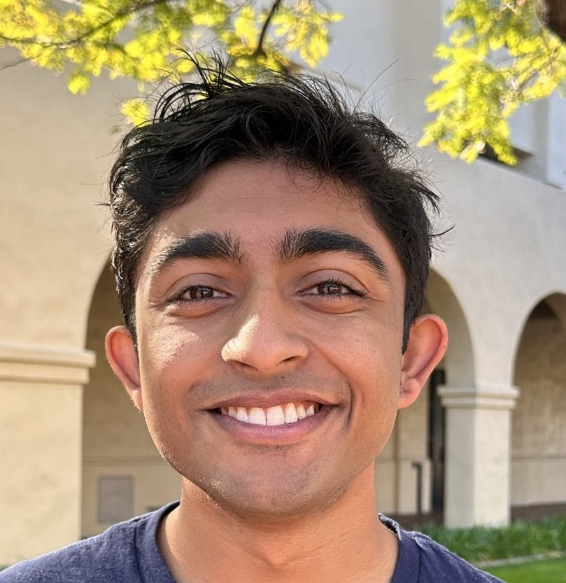

# Akshar Ramkumar

**Email:** aramkuma [at] caltech [dot] edu  
 
[Google Scholar](https://scholar.google.com/citations?user=u-EWI-wAAAAJ) · [CV](./cv.pdf)
 
 

---

## About

I am a fourth-year undergraduate at Caltech, majoring in mathematics! I will be a Master's student at Cambridge next year, and starting as a Berkeley PhD student in 2027. I love quantum computing and mathematics. Recently, I've been interested in quantum algorithms in mathematics, quantum Gibbs sampling, post-quantum cryptography, and unitary synthesis. 

Please reach out if you are interested in chatting, about math, quantum computing, or anything else!

---

## Manuscripts   
(For manuscript with red bullet points, all authors have equal contribution and are listed in alphabetical order).

- {: .red-bullets}
  *Post-Quantum Cryptography from Quantum Stabilizer Decoding*, March 2026    
  Jonathan Z. Lu, Alexander Poremba, Yihui Quek, **Akshar Ramkumar**
  CRYPTO 2026, \[[Arxiv:2603.19110](https://arxiv.org/pdf/2603.19110)\]

- {: .red-bullets}
  *Average-Case Complexity of Quantum Stabilizer Decoding*, September 2025    
  Andrey Boris Khesin, Jonathan Z. Lu, Alexander Poremba, **Akshar Ramkumar**, Vinod Vaikuntanathan  
  QIP 2026, STOC 2026, \[[Arxiv:2509.20697](https://arxiv.org/pdf/2509.20697)\]

- *High-Temperature Fermionic Gibbs States are Mixtures of Gaussian States*, May 2025  
  **Akshar Ramkumar**, Yiyi Cai, Yu Tong, Jiaqing Jiang   
  QIP 2026, \[[Arxiv:2505.09730](https://arxiv.org/pdf/2505.09730)\]

- *Mixing time of quantum Gibbs sampling for random sparse Hamiltonians*, November 2024    
  **Akshar Ramkumar**, Mehdi Soleimanifar  
  TQC 2025, \[[Arxiv:2411.04454](https://arxiv.org/pdf/2411.04454)\]

---

## Talks
- **Post-Quantum Cryptography from Quantum Stabilizer Decoding** (upcoming)
  - CRYPTO, August 2026
- **Average-Case Complexity of Quantum Stabilizer Decoding** (upcoming)
  - STOC, June 2026
- **High-Temperature Fermionic Gibbs States are Mixtures of Gaussian States** 
  - QIP, January 2026
- **Mixing time of quantum Gibbs sampling for random sparse Hamiltonians** · \[[slides](./slides/tqc_presentation_2025.pptx)\] · \[[video](https://www.youtube.com/watch?v=HQvTBtaSHbI)\]  
  - TQC, September 2025

